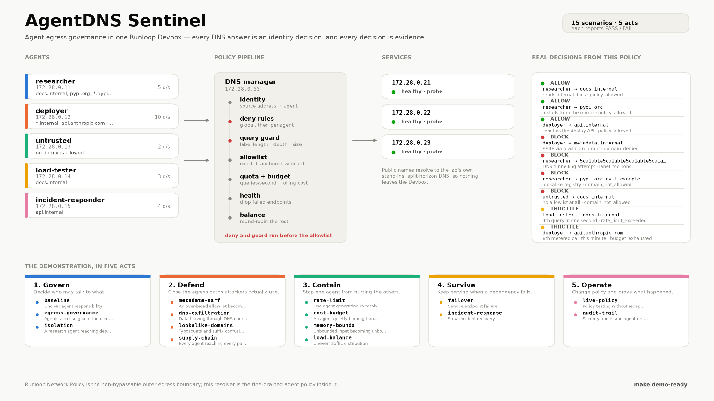
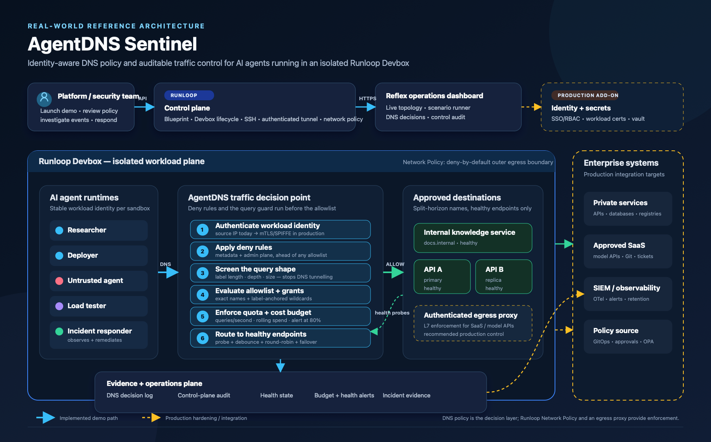

# AgentDNS Sentinel

Sandboxed traffic governance and observability for AI agents.

Agents sharing a sandbox need to be told what they may talk to, how much, and
what happens when a dependency dies. This is a working demonstration of that
control plane: identity-aware DNS policy, per-agent rate limits, round-robin
load balancing, health-based failover, runtime policy changes, and a decision
log you can audit — all running inside one Runloop Devbox.

Fifteen named scenarios exercise it, including the egress attacks agents
actually face: cloud-metadata SSRF through an over-broad allowlist, DNS
tunnelling under a permitted domain, lookalike registries, and per-agent
supply-chain scope. Each scenario reports **PASS** or **FAIL** with the checks
behind the verdict, from the browser or from the command line, so the demo is
evidence rather than a story.

For the practical problem statement, deployment fit, and a component-by-component
mapping of AgentDNS, Runloop, and Reflex, see
**[Real-world challenges and tool mapping](docs/real-world-use-cases.md)**.

```bash
make demo-ready  # validate, build, start, and verify all fifteen scenarios
```



Every decision on that board is produced by running the real policy engine
against `config/policies.json`, so the picture cannot drift from the code.
Regenerate it (light and dark) with `make demo-image`.

## The demonstration, in five acts

| # | Scenario | Challenge it answers | What you should see |
|---|---|---|---|
| **1. Govern** | | *Decide who may talk to what* | |
| 01 | `baseline` | Unclear agent responsibility | All five agents exercise their assigned role against one resolver |
| 02 | `egress-governance` | Agents accessing unauthorized services | Every untrusted lookup ends in `BLOCK` / `domain_not_allowed` |
| 03 | `isolation` | A research agent reaching deployment systems | `api.internal` is allowed for the deployer, denied for the researcher |
| **2. Defend** | | *Close the egress paths attackers actually use* | |
| 04 | `metadata-ssrf` | An over-broad allowlist becomes a credential-theft path | The deploy agent holds `*.internal` and is still refused `metadata.internal` |
| 05 | `dns-exfiltration` | Data leaving through the DNS queries themselves | A 48-character label under an *allowed* domain is refused as `label_too_long` |
| 06 | `lookalike-domains` | Typosquats and suffix confusion | `pypi.org` resolves; `pypi.org.evil.example` and `notpypi.org` do not |
| 07 | `supply-chain` | Every agent reaching every package registry | PyPI for the researcher, npm for the deployer, neither for the untrusted agent |
| **3. Contain** | | *Stop one agent hurting the others* | |
| 08 | `rate-limit` | One agent generating excessive traffic | `THROTTLE` appears once the 3 QPS quota is spent |
| 09 | `cost-budget` | An agent quietly burning a metered API budget | A warning at 80%, refusal at 100%, free destinations unaffected |
| 10 | `memory-bounds` | Unbounded input becoming unbounded state | 40 invented names refused, and no new per-query state |
| 11 | `load-balance` | Uneven traffic distribution | Answers for `api.internal` alternate between replicas |
| **4. Survive** | | *Keep serving when a dependency fails* | |
| 12 | `failover` | Service endpoint failure | API-A is really taken down; answers switch to API-B only |
| 13 | `incident-response` | Slow incident recovery | An agent repairs the service, not just the health flag |
| **5. Operate** | | *Change policy and prove what happened* | |
| 14 | `live-policy` | Policy testing without redeploys | One agent flips `BLOCK` → `ALLOW` → `BLOCK`, no restart |
| 15 | `audit-trail` | Security audits and network debugging | Every row names an agent, a domain, a decision and a reason |

### One demo per question

The acts tell the story in order. When a reviewer arrives with a single
question, run only what answers it:

| Capability | The question it answers | Command | Scenarios |
|---|---|---|---|
| **Security** | Can an agent reach something it should not? | `make demo-security` | 8 |
| **Availability** | Does the lab keep serving when a dependency fails? | `make demo-availability` | 5 |
| **Observability** | Can you prove afterwards what happened, and why? | `make demo-observability` | 5 |
| **Resource validity** | Do cost and memory stay bounded under abuse? | `make demo-resources` | 4 |

Every scenario is tagged with what it proves, and one scenario can answer more
than one question — `incident-response` is both availability and observability.
The same selectors work anywhere a scenario name does:

```bash
docker compose exec dashboard python scripts/demo.py run security
docker compose exec dashboard python scripts/demo.py run observability failover
python scripts/runloop_lab.py demo resources
```

**Resource validity** is the one that needed new machinery. A tunnelling client
invents a fresh name for every query, so if any per-query state were keyed by
the queried name, that alone would exhaust the resolver — no allowlist bypass
required. `GET /runtime` reports every in-memory structure and how full it is,
and `memory-bounds` asserts against it: state is keyed by agent and by
configured record, never by the query. The decision-log queue is bounded and
sheds its oldest lines under pressure rather than growing, and every shed line
is counted, so nothing is lost silently.

### Cost governance

A per-second rate limit stops a burst. It does nothing about an agent that
spends all day calling an expensive API at a polite pace, which is how a bill
actually runs away.

Destinations carry a **cost weight** — a unit stands for whatever the deployment
meters: tokens, cents, or calls — and each agent spends against a **rolling
budget**:

```json
"costs":  { "api.anthropic.com": 10, "*.pypi.org": 1 },
"agents": { "deployer": { "budget": { "window_seconds": 60, "max_cost": 50, "warn_at": 0.8 } } }
```

- At **80%** the resolver raises a `budget_warning`.
- At **100%** metered lookups are refused with `budget_exhausted`, and a
  `critical` alert is raised.
- **Unlisted destinations cost nothing**, so an agent that has exhausted its
  model budget can still read its documentation and reach internal services.
- Alerts are de-duplicated per agent and kind, so one runaway agent produces one
  notification rather than one per query.

They surface in three places: the **Budget alerts** panel on the dashboard (with
a live per-agent meter), `GET /alerts` and `GET /spend`, and the decision log,
where the reason distinguishes `budget_exhausted` from `rate_limit_exceeded`.
Raising an alert only appends to an in-memory ring buffer, so the notification
path adds nothing measurable to the resolver.

### How the policy decides

Order matters, and it is what makes the Defend act work:

```text
identity (source address → agent)
  └─ deny rules          global, then per-agent      → BLOCK domain_denied
      └─ query guard     label length, depth, size   → BLOCK label_too_long
          └─ allowlist   exact names + anchored *.   → BLOCK domain_not_allowed
              └─ quota   per-agent queries/second    → THROTTLE rate_limit_exceeded
                  └─ budget  rolling cost per agent  → THROTTLE budget_exhausted
                      └─ record → health → round-robin → ALLOW
```

Deny rules are checked **before** the allowlist, so a wildcard grant can never
open a forbidden name, and a live grant cannot override a deny rule. The guard
sits before the allowlist too, so a domain an agent may legitimately resolve
still cannot be used as a tunnel. Wildcards compile to label-anchored suffixes
(`*.pypi.org` → `.pypi.org`), which is why the lookalikes fail.

Public names resolve to the lab's own stand-ins — split-horizon DNS, the way
egress control works in practice — so the realistic domains add no containers
and never leave the Devbox.

## Architecture



The diagram separates what the demo implements today (solid blue/green paths)
from the controls a production rollout should add (dashed amber paths). In the
demo, each container has a stable workload identity, every DNS answer passes
through policy, quota, and health checks, and Runloop Network Policy is the
non-bypassable outer boundary. A real deployment would replace source-IP
identity with workload certificates, forward evidence to the organization's
SIEM, manage policy through an approval workflow, and route permitted external
traffic through an authenticated L7 egress proxy.

The editable source is
**[docs/agentdns-sentinel-reference-architecture.svg](docs/agentdns-sentinel-reference-architecture.svg)**;
the presentation-ready PNG is
**[docs/agentdns-sentinel-reference-architecture.png](docs/agentdns-sentinel-reference-architecture.png)**.

Three moving parts decide every answer:

- **Policy engine** — matches the source address to an agent identity, applies
  deny rules and the query-shape guard *before* the allowlist, spends the
  agent's per-second quota and rolling cost budget, then picks a healthy
  endpoint round-robin.
- **Health monitor** — probes each service once a second and debounces the
  result, so a single blip never evicts an endpoint and a flapping service never
  rejoins the pool prematurely. An operator override can pin an endpoint either
  way, and the dashboard shows which is in effect.
- **Alert center** — notifies when an agent crosses 80% and then 100% of its
  budget, de-duplicated per agent and kind so one runaway agent is one alert.
- **Evidence store** — records DNS decisions and control-plane changes. DNS
  rows show agent, source address, domain, decision, reason and latency; control
  rows show the actor, scenario, action, resource and before/after state.

## Run it locally

Requirements: Docker Desktop with Docker Compose. `make help` lists every target.

```bash
cp .env.example .env  # recommended: replace every value before a shared demo
make up                 # docker compose up --build -d
make demo               # every scenario, narrated, exits non-zero on failure
make check              # unit tests + static checks + Compose validation
make demo-ready         # check + up + end-to-end smoke test
make scenarios          # the catalogue, without running anything
make logs
make down
```

Open <http://localhost:3000> for the dashboard. It is built for showing the
project to someone, top to bottom:

- **Stat tiles and a decision-mix bar** — the traffic split by outcome, updating live.
- **Live topology** — the five agents on the left with their most recent decision
  and running tally, the policy pipeline in the middle, the three services on the
  right with their health and where that health came from (probe or override).
  Each service has a **Take down** button that fails the real container, so you
  can trigger failover by hand and watch DNS route around it.
- **The five acts** — fifteen scenario cards, each with **Run**, plus **Run act** to
  play a whole act and **Run full demo** for all fifteen with a progress bar. Every
  card keeps its own PASS/FAIL badge, and the result panel shows the individual
  checks behind the verdict.
- **Decision log** — every DNS answer, filterable by `ALLOW` / `BLOCK` /
  `THROTTLE` and the failure codes.
- **Control-plane audit trail** — every policy and health change with the actor
  and the scenario that caused it.

**Live updates** polls every three seconds; turn it off while presenting a frozen
state. **Reset** restores the starting policy, revives every mock service and
clears both logs.

The interface is legible in light and dark. Outcome colours come from a fixed
four-step status palette whose segment order was checked with a colour-vision
validator, and every status colour is paired with an icon and a label, so no
meaning is carried by hue alone.

The control API is published on <http://localhost:8053> and requires a bearer
token on every endpoint except `/health`. If you did not create `.env`, use the
disposable local-demo default shown here:

```bash
CONTROL_TOKEN=${CONTROL_TOKEN:-demo-control-token}
curl -s -H "Authorization: Bearer $CONTROL_TOKEN" \
  localhost:8053/endpoints | python3 -m json.tool
curl -s -H "Authorization: Bearer $CONTROL_TOKEN" \
  'localhost:8053/events?limit=5' | python3 -m json.tool
```

### Driving it by hand

```bash
docker compose exec researcher python -c "import socket; print(socket.gethostbyname('docs.internal'))"
docker compose exec untrusted  python -c "import socket; print(socket.gethostbyname('docs.internal'))"
curl -s -X POST localhost:8053/endpoints/172.28.0.22/inject \
  -H "Authorization: Bearer $CONTROL_TOKEN" \
  -H 'X-Actor: live-demo-operator' \
  -H 'content-type: application/json' -d '{"fail": true}'
```

The second command fails because the resolver returns `REFUSED`. The third takes
API-A genuinely offline; the health monitor notices within about two seconds and
DNS stops handing out that address.

### Running one act at a time

```bash
docker compose exec dashboard python scripts/demo.py run failover incident-response
docker compose exec dashboard python scripts/demo.py run all --json
python scripts/verify_demo.py          # host-side wrapper, CI-friendly
```

## Run it on Runloop

```bash
make runloop-setup
# Edit .env and replace RUNLOOP_API_KEY with your key.
make runloop-e2e
```

The setup target creates an isolated `.venv`, installs the Runloop SDK, creates
an ignored `.env`, and generates unique application tokens. The end-to-end
target validates the setup, applies a Runloop **Network Policy** as the outer
egress boundary, builds or reuses a
**Blueprint** from this repository, starts a **Devbox** with tunnels, syncs your
working tree, brings the lab up, runs all fifteen scenarios inside the Devbox, and
writes the verdicts, raw DNS decisions and attributed control actions to
`artifacts/`. It leaves the Devbox running for the dashboard; use
`make runloop-down` when finished.

Step through it instead, or read about the two-layer boundary, blueprints,
snapshots and the environment variables, in **[docs/runloop.md](docs/runloop.md)**.
For a short live presentation, use the **[demo runbook](docs/demo-runbook.md)**.

```bash
make runloop-up      # Devbox + tunnels + lab, prints the dashboard URL
make runloop-demo    # scenarios + evidence
make runloop-down
```

### Give local Codex access to Runloop

The Devbox automation above uses the Python SDK. To also expose Runloop as MCP
tools to the local Codex CLI or desktop app, install Runloop's CLI and register
the project launcher:

```bash
npm install -g @runloop/rl-cli
make runloop-mcp-setup
```

The launcher reads `RUNLOOP_API_KEY` from the ignored project `.env`; it does
not write the key into Codex configuration or shell startup files. Restart
Codex after registration, then ask: “List my Runloop Devboxes.”

## Agent roles

| Agent | Purpose | Initial DNS access | Quota |
|---|---|---|---|
| Researcher | Read internal documentation | `docs.internal` | 5 QPS |
| Deployer | Reach the replicated deployment API | `api.internal` | 10 QPS |
| Untrusted | Demonstrate policy denial | None | 2 QPS |
| Load tester | Produce controlled DNS bursts | `docs.internal` | 3 QPS |
| Incident responder | Detect failover and restore service health | `api.internal` plus control API | 4 QPS |

## Control API

| Endpoint | Purpose |
|---|---|
| `GET /agents`, `GET /endpoints` | Current policy and endpoint health, with the health source |
| `GET /dashboard` | One consolidated payload for the Reflex live view |
| `GET /events`, `GET /summary` | Decision log and aggregate counts |
| `GET /control-events` | Scenario and operator actions, including actor and before/after state |
| `POST /agents/{agent}/access` | Grant or revoke a domain at runtime |
| `POST /endpoints/{address}/inject` | Take the real service down or bring it back |
| `POST /endpoints/{address}/health` | Pin health, overriding the probe |
| `DELETE /endpoints/{address}/health` | Hand the endpoint back to the probe |
| `GET /alerts`, `GET /spend` | Budget notifications and per-agent spend |
| `GET /runtime` | In-memory state, queue depth, shed lines, resident memory |
| `POST /budgets/reset` | Start a fresh budget window, so a cost demo can run twice |
| `POST /reset` | Restore the starting policy, revive services, clear the log |

## Repository layout

| Path | What it is |
|---|---|
| `dns_manager/` | Policy engine, health monitor, DNS resolver, control API, event store |
| `agents/` | The five agent containers and the incident responder's logic |
| `mock_service/` | Services that can genuinely be taken down and brought back |
| `demo/` | The scenario catalogue and the runner that produces verdicts |
| `dashboard/` | The Reflex UI: `tokens`/`theme` (design tokens), `view_model` (pure row shaping), `state`, `views` |
| `runloop_lab/` | Runloop config, request builders and lifecycle orchestration |
| `scripts/` | `demo.py` (scenarios), `runloop_lab.py` (Runloop), `verify_demo.py` (CI) |
| `tests/` | Unit tests, an in-process fake lab, and a fake Runloop SDK |

## Performance

The resolver used to write its decision log inline, inside the DNS request
path: one SQLite connection, one commit, one fsync per query. `scripts/benchmark.py`
runs the real engine and store and measures it:

```bash
python3 scripts/benchmark.py
```

| path | queries/s | p99 |
|---|---|---|
| policy engine only | ~14,000 | 3.3 ms |
| + decision log, queued | ~6,800 | 8.1 ms |
| + decision log, inline commit | ~4 | 1,424 ms |

Queuing the log is ~1,700x the throughput and takes p99 from 1.4 s to 8 ms on
this filesystem. The inline figure is dominated by fsync so it varies by disk,
but the shape does not: a DNS answer should never wait on one. Decisions now go
to a writer thread that batches them behind a single long-lived connection, and
readers flush the queue first, so the API still never serves a stale count.

Three other things were on the hot path and no longer are:

- **Rule matching** is compiled once per configuration change — exact names in a
  set, wildcards as anchored suffixes, agents indexed by source address —
  instead of re-normalising every pattern on every query.
- **The lock** is held only for the rate window, round-robin cursor and health
  map. Identity, deny, guard and allowlist checks read an immutable snapshot.
- **Health probes** run concurrently, so a sweep costs one timeout rather than
  one per unreachable endpoint.

## Run the tests

```bash
make test          # python3 -m unittest discover -v
```

The suite covers the policy engine, both audit streams, the health-probe state
machine, every scenario in the catalogue, and the whole Runloop flow. Scenario
tests run against an in-process fake lab (`tests/fake_lab.py`) that drives the
real policy engine, and the Runloop tests run against a fake SDK
(`tests/fake_runloop.py`), so everything is verified without Docker or an API key.

## Security boundary

This is an educational sandbox. Agent HTTP entry points use separate bearer
tokens, while the DNS policy maps each fixed container IP to an agent identity.
The included `demo-*` credentials are intentionally public conveniences: copy
`.env.example` to `.env` and replace them for a shared or remotely accessible
demo. Production identity should use workload certificates or another
cryptographically authenticated identity.
DNS alone can be bypassed with raw IP addresses or an alternative resolver, which
is exactly why the Runloop flow applies a Network Policy as the outer,
non-bypassable layer — see [docs/runloop.md](docs/runloop.md#two-boundaries-not-one).
For production, add an authenticated egress proxy as well, and use an
authenticated tunnel (`RUNLOOP_TUNNEL_AUTH=authenticated`) for the dashboard.
Runloop tunnels are HTTP/WebSocket based, so the UDP DNS service deliberately
remains internal to the Devbox.

The five containers are deterministic role-specific workload agents, which
makes every demo repeatable. The incident responder also observes and remediates
failures. They are integration points for an LLM agent runtime, not a claim that
five language models are running continuously; replace a role's `/query` or
`/fetch` caller with your framework of choice while preserving its identity and
token.
